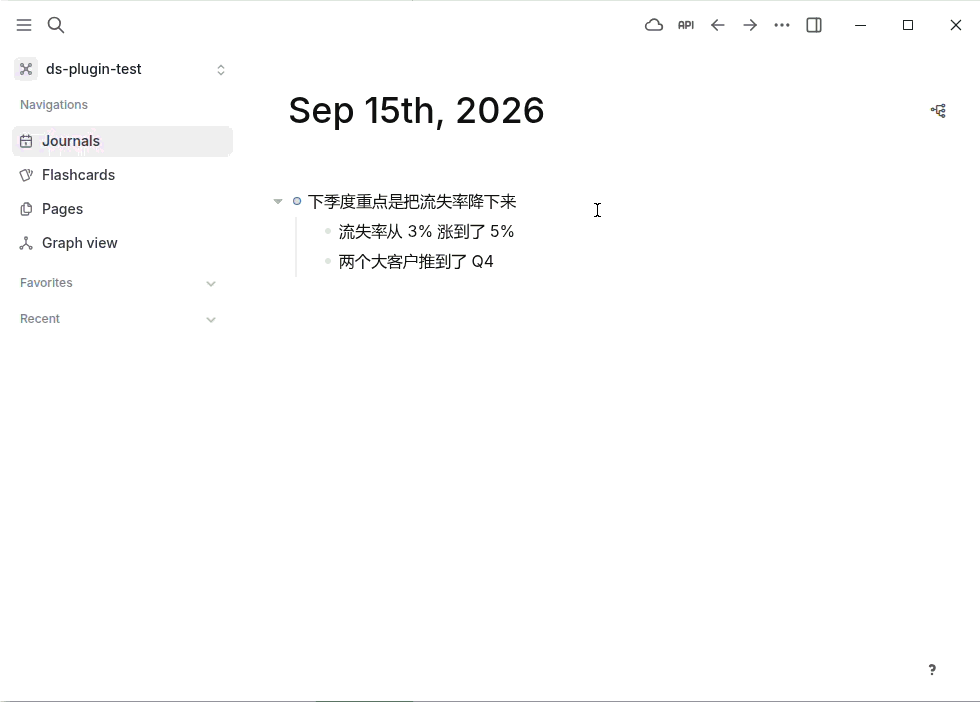
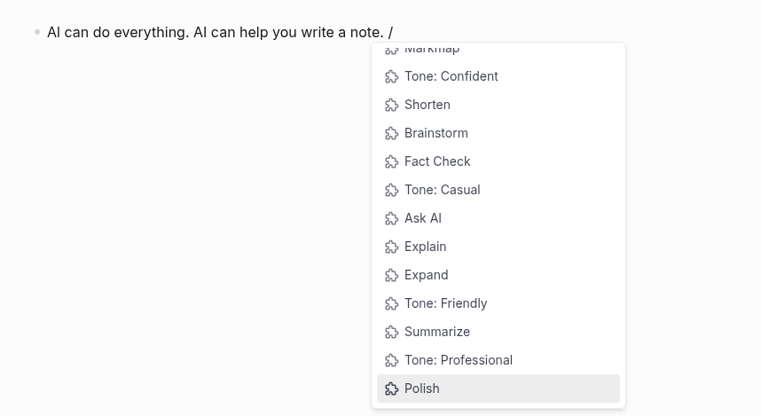
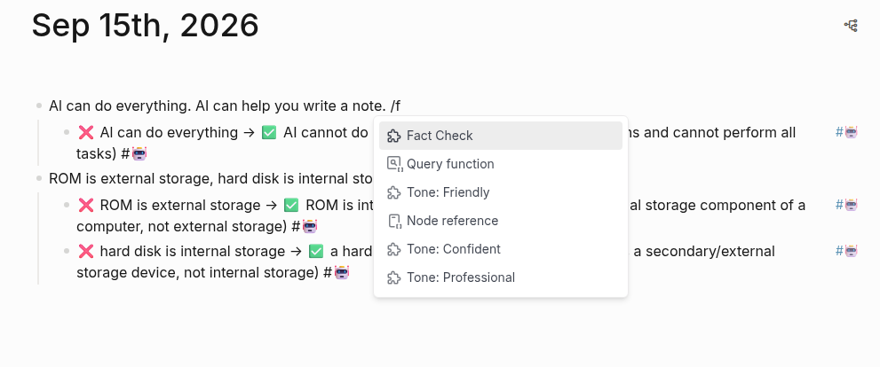

# Logseq DeepSeek Assistant

Call DeepSeek from a slash command, right inside a Logseq block. **English** | [中文](./readme.zh-CN.md)

Type `/Polish` in a block and DeepSeek rewrites it — the block **and the points nested under
it**, each one updated in place. No window switching, no copy-paste; the answer lands in your
notes.



A DeepSeek port of [ahonn/logseq-plugin-ai-assistant](https://github.com/ahonn/logseq-plugin-ai-assistant) (MIT).

## Quick start

**1. Get an API key** — sign up at [platform.deepseek.com](https://platform.deepseek.com/api_keys)
and create a key. DeepSeek is prepaid, so add a small balance too.

**2. Install the plugin**

Turn on developer mode in Logseq (`Settings → Advanced → Developer mode`), then either
download a release package, or build it yourself:

```sh
pnpm install && pnpm build
```

Then `Plugins → Load unpacked plugin` and pick this folder.

**3. Paste your key** into the plugin settings. That is the only required setting.

**4. Try it** — put the cursor in any block and type `/Summarize`.

## The commands

Twelve commands come built in, plus two that need a search key. Type `/` in a block and start typing the name.



| Command | What it does | Where the answer goes |
| --- | --- | --- |
| `/Ask AI` | Answers the question in the block | New child block |
| `/Summarize` | Condenses the block | A `summarize::` property on the block |
| `/Polish` | Fixes awkward phrasing, redundancy and grammar without changing your voice | Replaces the block text |
| `/Shorten` | Cuts it down, keeping the key points | Replaces the block text |
| `/Expand` | Fills it out with more detail | Replaces the block text |
| `/Explain` | Explains the text or code | New child block |
| `/Fact Check` | Flags statements it believes are objectively false | One child block per error |
| `/Ask Online` | Looks the answer up and cites its sources — **only when a search key is set** | New child block |
| `/Verify Online` | Searches the web and cites a source for each verdict — **only when a search key is set** | One child block per claim |
| `/Brainstorm` | Suggests related ideas | One child block per idea |
| `/Tone: Friendly` `/Tone: Confident` `/Tone: Casual` `/Tone: Professional` | Rewrites in that tone | Replaces the block text |

Type `/tone` to see the four tone commands together.



**`/Fact Check` never rewrites your text.** It judges correctness from the model's own
knowledge — which can be wrong, and confidently so — so instead of "correcting" the block it
lists each claim it believes is false as a child block, in the form
`❌ the claim → ✅ the correction (reason)`, and leaves your block exactly as it was. If it finds
nothing, it adds one child block saying so. You decide what to change. Treat its output as a
second opinion, not an authority, and verify anything that matters.

**`/Polish` and `/Tone: …` are different jobs.** Polish keeps your register and cleans up the
writing; the Tone commands change the register. Both are explicitly told not to add, remove or
invent information. `/Shorten` and `/Expand` are not — changing the amount of detail is the
point of those two.

Answers come back in the language you wrote in — ask in Chinese, get Chinese; write in English
or German and the answer stays in it, whether the command searches the web or not. (This rule is
built into the preset prompts only; custom prompts say whatever you tell them to.)

Everything the AI writes is tagged `#[[🤖]]` so you can find it later: replaced or appended
text, every child block it inserts, and a block that gained a property. The tag goes at the end
of the text — or on a line of its own after a closing code fence (`` ``` #[[🤖]] `` would stop the
fence closing) or after a `key:: value` line (the tag would become part of the value). You can change or remove the tag in the settings.

### Giving it context

A command reads the block you are in **plus everything nested under it**. So this:

```
- What should we prioritize next quarter?     ← type /Ask AI here
  - Churn rose from 3% to 5%
  - Two enterprise deals slipped to Q4
  - Engineering is at capacity
```

sends all four lines to the model, not just the question.

One exception: child blocks carrying the `#[[🤖]]` tag are skipped, along with anything nested
under them, because the tag is how the plugin recognises its own earlier output. Without this,
running `/Ask AI` and then `/Tone: Professional` on the same block would feed the answer back
in, and the tone command would rewrite the answer instead of the question. The rule is only as
good as the tag:

- The tag is matched as a whole token (`#AI` does not match `#AIDS`), but any child block that
  contains it is skipped — including one you wrote yourself that quotes the tag, and a nested
  block the plugin merely rewrote or gave a property to earlier. Delete the tag from a block to
  have it read again.
- Only the current Tag setting is recognised. Output written under an earlier tag, or while the
  Tag setting was empty, is read like any other block — and with the setting cleared the
  protection is off altogether.
- The block you run the command in is always read, tag or no tag.

Logseq metadata (`id::`, `collapsed::`, and your own `key:: value` lines) is stripped before
sending — the model sees your writing, not the plumbing — and is put back afterwards. If you
run a command while still typing in the block, the plugin uses what is in the editor, not the
last saved version.

## Settings

| Setting | Default | What it is for |
| --- | --- | --- |
| **API Key** | *(empty)* | **Required.** Your DeepSeek key |
| **API Base URL** | `https://api.deepseek.com/v1` | Only change this if you go through a proxy or another OpenAI-compatible endpoint |
| **Model** | `deepseek-chat` | See below. A custom prompt can override it per command |
| **Temperature** | `0.3` | How closely the answer sticks to your text. Low is right for rewriting; raise it towards `1.3` for Brainstorm or Ask AI |
| **Tag** | `[[🤖]]` | Added to AI output. Write it without the `#`; leave empty to turn tagging off |
| **Web Search API Key** | *(empty)* | Optional. A [Tavily](https://tavily.com) key; enables `/Ask Online`, `/Verify Online` and any custom prompt with `"search": true` |
| **Custom Prompts** | off | Your own commands — see [Writing your own commands](./docs/custom-prompts.md) |

Changes to the first five apply to the next command you run; no reload needed. A field you
have cleared — even to a few spaces — counts as unset and falls back to its default. The Web
Search API Key is different: it decides whether the searching commands are registered at all, so
setting or clearing it needs a reload — the plugin reminds you once, when the set of commands
changes.

Until an API key is set, the plugin says so once when it loads, so a fresh install is not left
guessing why a command fails.

Logseq saves the Temperature field as text once you have edited it (`"0.3"`, not `0.3`); the
plugin reads it either way. Earlier builds did not, and silently ran every command at
DeepSeek's own default of `1.0` as soon as the field had been touched.

A changed default does not reach an existing install: Logseq keeps the values already stored, so
if you set the plugin up before the default moved to `0.3`, your Temperature is still `1.0`
until you change it.

### Which model?

- **`deepseek-chat`** — fast and cheap. Right for almost everything: summarizing, rewriting,
  changing tone.
- **`deepseek-reasoner`** — thinks step by step before answering. Better for analysis and hard
  questions, and noticeably slower. It is not a pricier model: both names route to the same one
  and are billed at the same rate, but its thinking counts as output, so a run costs more than
  the same question asked of `deepseek-chat`. Its thinking never reaches your block; during a
  `/Verify Online` run it is handed back to the model between searches, as the API requires, and
  dropped once the answer is in. The Temperature setting is not sent to it.

  It was measured against the live suite on the cells most likely to catch a thinking model out
  — the one-line `summarize::` property, code blocks that must survive a rewrite, a true claim
  that invites nitpicking, and language on Chinese and German input — 24 cells × 2 samples,
  156/156 property checks. Its searching path is verified only on a handful of runs.

DeepSeek's API currently names its models `deepseek-flash` and `deepseek-v4-pro` in its own
messages; `deepseek-chat` and `deepseek-reasoner` are still accepted and map onto them. Either
spelling works in the Model setting. A name DeepSeek does not know fails with
`DeepSeek does not know the model "…"`, which quotes the names it does.

## When something goes wrong

Every failure shows up as a Logseq notification. The common ones:

| Message | What to do |
| --- | --- |
| `DeepSeek Assistant: no API key set yet. …` | Shown once when the plugin loads without a key. Paste your key into the settings |
| `No DeepSeek API key configured. Set it in the plugin settings.` | Paste your key into the settings |
| `The API Base URL must start with https:// — it is "…".` | The API Base URL setting has no scheme. The default is `https://api.deepseek.com/v1` |
| `Nothing answers at … (404). Check the API Base URL setting …` | The URL points at nothing — a typo in the path, most likely. Reset the API Base URL to its default |
| `DeepSeek request failed (…): … answered with a web page, not an API reply.` | The URL reaches a website, not the API — `platform.deepseek.com` instead of `api.deepseek.com`, say. Reset the API Base URL |
| `DeepSeek does not know the model "…" (400): …` | The Model setting (or a custom prompt's `model`) names a model DeepSeek does not have; the message lists the ones it does |
| `Invalid DeepSeek API key (401): …` | Re-copy the key into settings |
| `DeepSeek account has insufficient balance (402): …` | Top up at platform.deepseek.com |
| `DeepSeek rate limit reached (429): …` | Wait a moment and retry |
| `Could not reach …` | Check your network and the API Base URL |
| `DeepSeek did not answer within 300 s.` | Retry. If it keeps happening on `deepseek-reasoner`, switch to `deepseek-chat` or use a smaller block |
| `DeepSeek stopped at its output limit — the answer may be cut off.` | The answer was written but may be truncated. Ask for something shorter |
| `The block is empty — nothing to send to DeepSeek.` | The block (and its children) had no text after removing properties |
| `The block was deleted while DeepSeek was answering.` | The answer was discarded. Run the command again on the new block |
| `This block has no text of its own to rewrite. Run the command on a block with text, or on one of the children.` | `/Polish`, `/Shorten`, `/Expand`, `/Tone:` and custom `replace` prompts only: the block is empty (or holds only the tag) and has children. Rewriting from here would shift every child up by one, so nothing was sent |
| `DeepSeek returned nothing to insert.` | The reply had no usable line — with `/Fact Check`, every line it wrote was about a statement it found nothing wrong with, and those are dropped. Run it again, or on a smaller block |
| `This Logseq version cannot set block properties on a DB graph. Update Logseq, or change the prompt’s "output" away from "property".` | DB graphs only: this Logseq build has no `upsertBlockProperty`. Update Logseq, or give the prompt another `output` |
| `Could not write the "…" property on this DB graph: …` | DB graphs only: the property could not be defined or written; the message says why. Create the property in Logseq first, or give the prompt `output: insert` |
| `DeepSeek kept searching without answering (4 rounds). Try a shorter block.` | Searching commands only (`/Ask Online`, `/Verify Online`, custom prompts with `search`): the model wanted a fifth round of searching. Put fewer claims or questions in the block |
| `No Tavily API key configured. Set it in the plugin settings.` | A searching command was registered while a search key was set, and the key has since been cleared (or blanked to spaces). Set it again, or reload the plugin to drop the command |
| `Invalid Tavily API key (401): …` | Re-copy the Tavily key into settings |
| `Tavily rate limit or monthly quota reached (429): …` | The month's searches are used up. Wait for the reset or upgrade the plan |
| `Tavily plan limit reached (432): …` | Your Tavily plan does not allow the request; check the Tavily dashboard |
| `DeepSeek Assistant ignored N custom prompt(s): …` | One of your custom prompts is malformed, or the `customPrompts` setting as a whole has the wrong shape; the message says which |
| `Available commands changed. Reload the plugin to update the slash menu.` | You added, renamed or removed a custom prompt, or set or cleared the Web Search API Key. Said once per such change |

Still stuck? Open the Logseq developer console (`Ctrl+Shift+I`) — the full error is logged there.

## More

- [How it works](./docs/how-it-works.md) — what the commands do to a block, the two Logseq
  storage backends, rewriting a block that has children, and how `/Verify Online` checks a claim.
- [Writing your own commands](./docs/custom-prompts.md) — custom prompts: the fields, the four
  output modes, and letting one search the web.
- [Development](./docs/development.md) — building and testing, the live prompt suite, and what
  changed from the project this was forked from.

## Licence

MIT, same as upstream.
